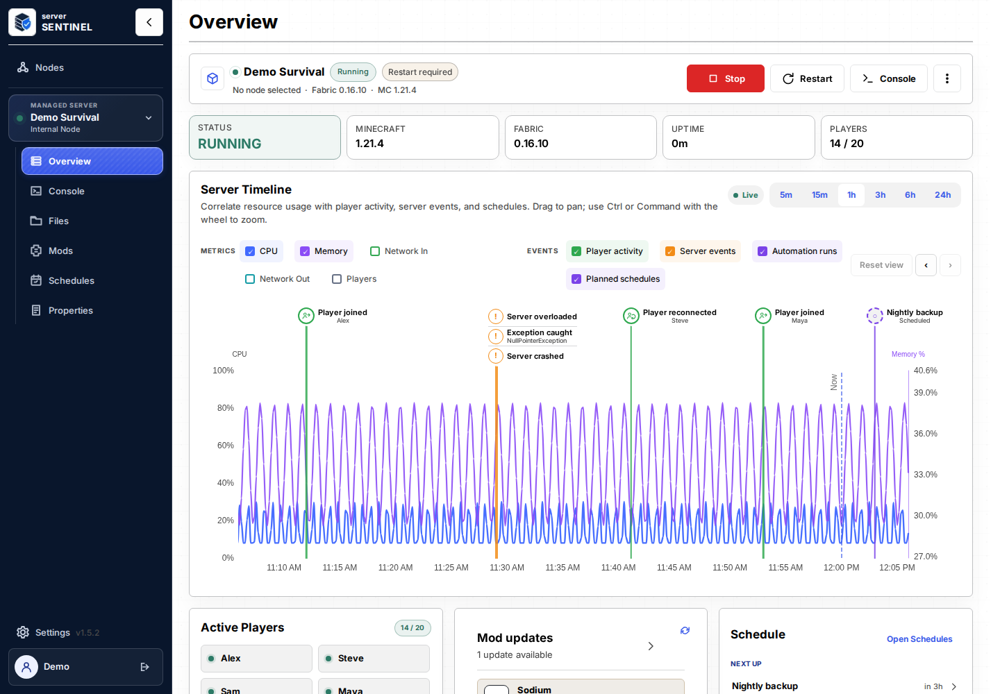
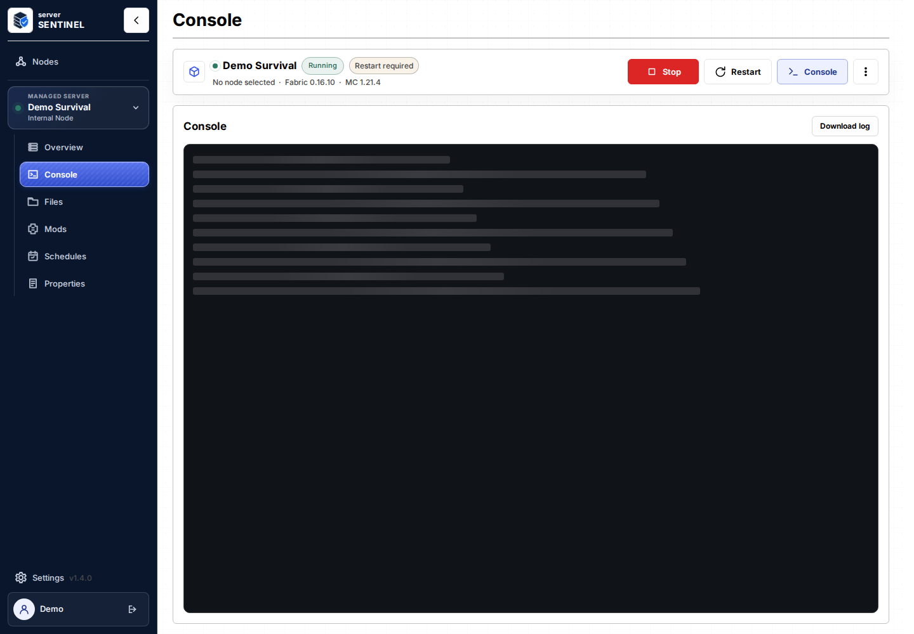
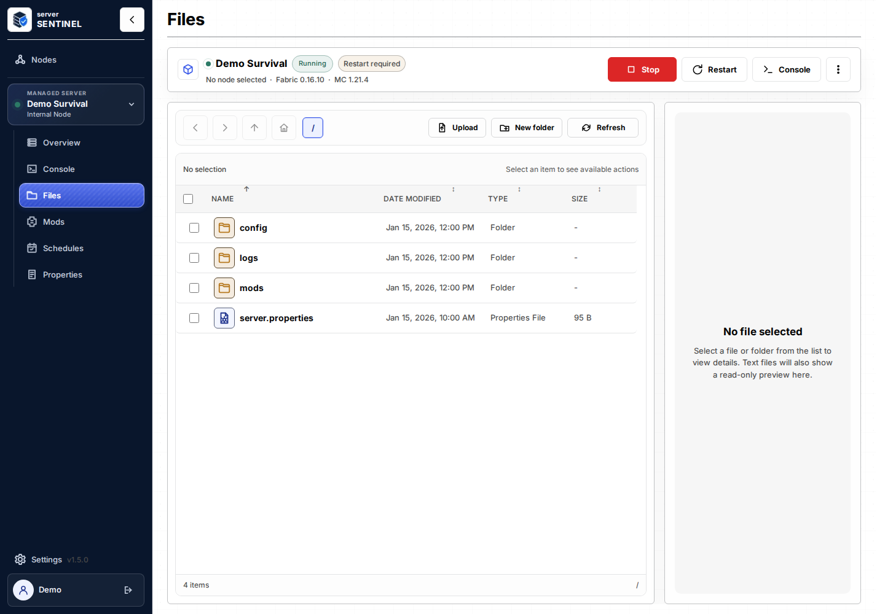
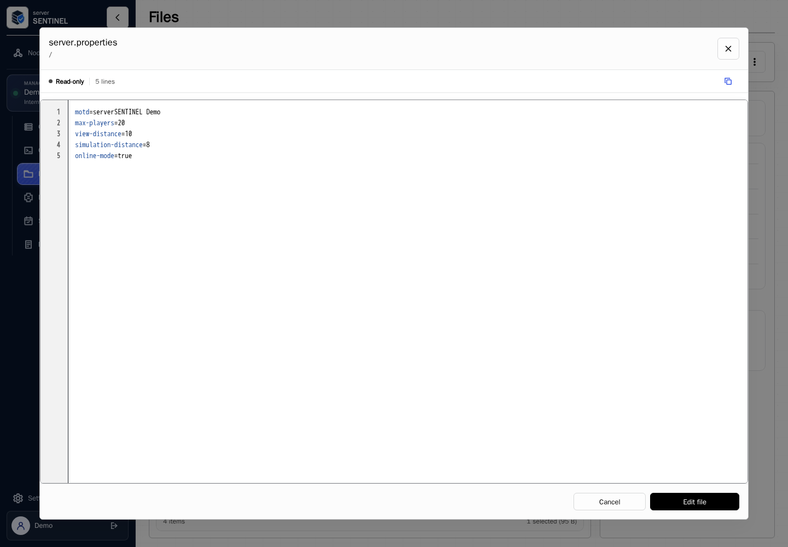
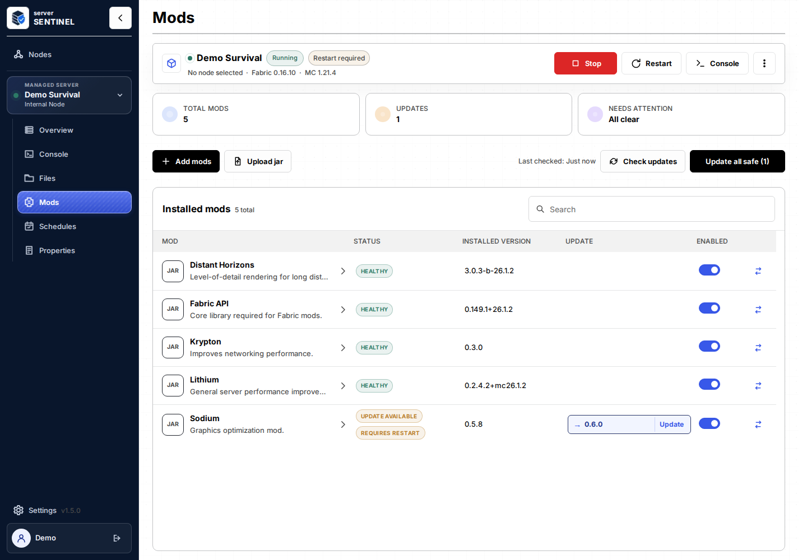
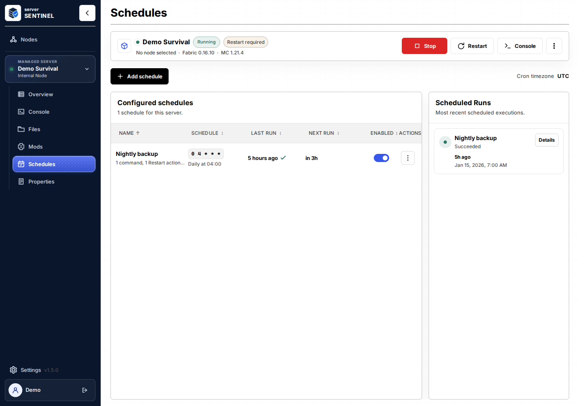
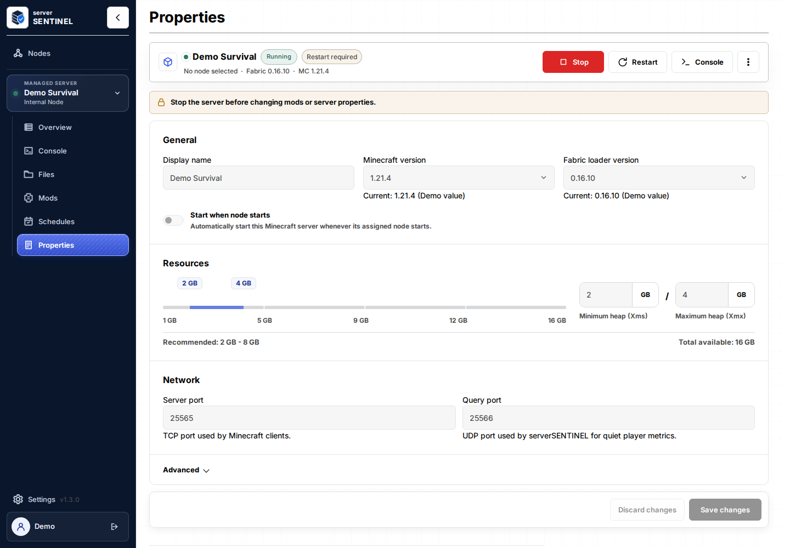
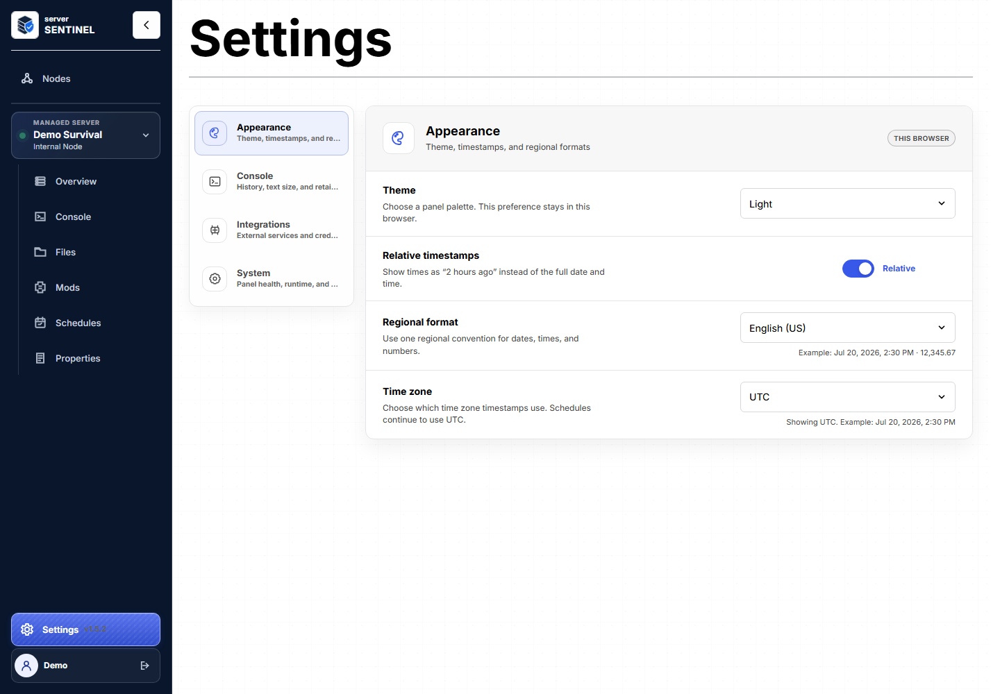
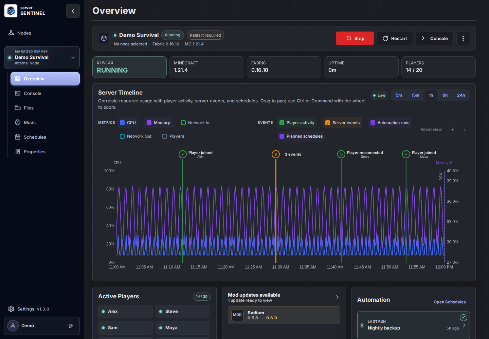

# serverSENTINEL

serverSENTINEL is a web panel for running Minecraft servers with Docker. It gives you a browser-based place to create servers, start and stop them, view the live console, send commands, manage files, install mods, schedule actions, and manage users.

It's not recommended to expose the panel directly to the public internet. Use it on a LAN, behind a VPN, through Cloudflare Tunnel, or behind a reverse proxy with strong authentication. Treat panel access, node secrets, Docker access, console access, and file manager access as administrative control over the machines and servers involved.

## Screenshots

<table>
  <tr>
    <td valign="top" width="50%">
      <p align="center"><strong>Overview</strong></p>
      <a href="docs/screenshots/overview.png">
        
      </a>
      <p align="center">Server list, status, and high-level controls.</p>
    </td>
    <td valign="top" width="50%">
      <p align="center"><strong>Console</strong></p>
      <a href="docs/screenshots/console.png">
        
      </a>
      <p align="center">Live output and command input.</p>
    </td>
  </tr>
  <tr>
    <td valign="top" width="50%">
      <p align="center"><strong>File Manager</strong></p>
      <a href="docs/screenshots/files.png">
        
      </a>
      <p align="center">Browse and manage server files.</p>
    </td>
    <td valign="top" width="50%">
      <p align="center"><strong>File Editor</strong></p>
      <a href="docs/screenshots/file-editor.png">
        
      </a>
      <p align="center">Edit server configuration and text files safely.</p>
    </td>
  </tr>
  <tr>
    <td valign="top" width="50%">
      <p align="center"><strong>Mod Management</strong></p>
      <a href="docs/screenshots/mods.png">
        
      </a>
      <p align="center">Manage server mods and updates.</p>
    </td>
    <td valign="top" width="50%">
      <p align="center"><strong>Schedules</strong></p>
      <a href="docs/screenshots/schedules.png">
        
      </a>
      <p align="center">Create and edit scheduled server actions.</p>
    </td>
  </tr>
  <tr>
    <td valign="top" width="50%">
      <p align="center"><strong>Server Properties</strong></p>
      <a href="docs/screenshots/properties.png">
        
      </a>
      <p align="center">Review and update server configuration.</p>
    </td>
    <td valign="top" width="50%">
      <p align="center"><strong>Settings</strong></p>
      <a href="docs/screenshots/settings.png">
        
      </a>
      <p align="center">Configure panel settings.</p>
    </td>
  </tr>
  <tr>
    <td valign="top" colspan="2">
      <p align="center"><strong>Dark Mode</strong></p>
      <a href="docs/screenshots/overview-dark.png">
        
      </a>
      <p align="center">The full interface is also available in dark mode.</p>
    </td>
  </tr>
</table>


## How It Works

serverSENTINEL has two runtime roles:

- **Panel**: the web UI and API. It stores users, settings, node definitions, and server metadata.
- **Node agent**: a host-side agent that connects back to the panel and performs Docker, console, file, mod, and server operations on its own machine.

The panel can manage servers across one or more nodes. In multi-host setups, each node is responsible for Docker operations on the host where it runs. A panel-only container should not need direct Docker socket access when all server operations are handled by remote node agents.

Supported modes:

- **All-in-one / local node**: the panel and local Docker management run on the same host. This is the recommended setup for simple single-host use.
- **Panel**: runs only the web panel. Use this for multi-host setups where separate node agents manage servers.
- **Node**: runs only a node agent. Use this on each Docker host that should run Minecraft servers.

Minecraft itself does not run inside the panel container. Managed Minecraft servers run as separate Docker containers created and controlled by serverSENTINEL.

Minecraft runtime containers do not use Docker process-exit restart loops. serverSENTINEL records whether each server should be running: a Minecraft crash or `stop` command leaves it stopped, while servers that were running are restored after the panel and node agents return from a host or Docker daemon restart.

## Features

- Server overview with status and runtime information
- Docker-based server creation and management
- Start, stop, and restart controls
- Live console output
- Console command input
- File manager
- Browser file editor with read-only viewing, exclusive edit leases, revision checks, line numbers, and syntax highlighting
- Modrinth search and install flow
- Mod upload and management
- Schedules
- Settings
- Local user management and permissions
- Multi-node management
- Add node flow with generated install commands
- Node connection and status handling

## Safety Notes

- Do not expose the panel directly to the public internet.
- Prefer LAN-only access, a VPN, Cloudflare Tunnel, or a reverse proxy with additional authentication.
- Protect API keys, node join tokens, node secrets, user passwords, and Docker socket access.
- Docker socket access is powerful. A container with access to `/var/run/docker.sock` can control Docker on the host.
- File manager and console access are powerful administrative features. Give those permissions only to users you trust.
- Keep backups of your serverSENTINEL data root before upgrading or changing Docker volume mappings.

## Storage

serverSENTINEL 1.0 uses storage model v2, introduced in 0.8.0. Application state is stored in one local SQLite database under one runtime data root. Users, sessions, settings, nodes, managed servers, ports, schedules, scheduled runs, resource-stat history, mod preferences, file edit leases, and node identity records are stored there. No external database service is required.

The default runtime data root is `/data`:

```text
/data
  serversentinel.sqlite
  servers/
  backups/
  imports/
  exports/
  tmp/
```

Set `SERVERSENTINEL_DATA_DIR` to use a different data root. serverSENTINEL derives every application storage path from that root and creates the required directories on startup.

If you are upgrading from 0.8.x to 1.0, keep the same `SERVERSENTINEL_DATA_DIR` and Docker server-volume mapping. No database migration step is required for 0.8.x data roots. Older pre-0.8 JSON configuration files such as `users.json`, `nodes.json`, `servers.json`, settings JSON files, and old `/config` database locations are not read by 1.0; move those installs to 0.8.x first or start with a fresh 1.0 data root.

### Backup And Restore

For a complete 1.0 backup, preserve both the panel data root and the managed server directory storage. In the default Docker Compose setup, that means backing up the `serversentinel-data` volume and the `serversentinel-minecraft-servers` volume together.

The safest file-copy backup is:

1. Stop serverSENTINEL.
2. Stop any managed Minecraft servers if you need a world-consistent backup.
3. Copy `serversentinel.sqlite` and any adjacent `serversentinel.sqlite-wal` or `serversentinel.sqlite-shm` files from the data root.
4. Copy `servers/`, or the Docker volume mounted at `/data/servers`, using the same point in time as the SQLite files.
5. Restart serverSENTINEL.

Restore by stopping serverSENTINEL, restoring those files or volumes back to the same `SERVERSENTINEL_DATA_DIR` and server-volume mapping, then starting the same or newer 1.0-compatible image. Do not restore only the SQLite database without the matching managed server directories; server IDs, paths, ports, schedules, mod preferences, and file edit leases are stored in SQLite while the Minecraft files live in server storage.

Managed servers and nodes use immutable backend-generated IDs. Local managed server files live under `servers/<serverId>/`; renaming a server changes only its display label, not its ID, directory, schedules, mods, logs, jobs, or Docker container name. Leave the Docker container field blank during creation to let serverSENTINEL generate a stable container name from the server ID.

The file editor opens files read-only. Entering edit mode acquires a short-lived exclusive lease for that server/path while other users can continue viewing it. Active editors heartbeat the lease, stale leases expire automatically, and saving is rejected if the file changed outside serverSENTINEL after edit mode began.

Recommended persistent storage:

```bash
docker volume create serversentinel-data
docker volume create serversentinel-minecraft-servers
```

The included compose file uses `serversentinel-data` for panel state and `serversentinel-minecraft-servers` for managed server directories. If you use host bind mounts instead, the path used by Minecraft sibling containers must be visible to the Docker daemon on the host, not only inside the panel container.

## Release Notes

See [CHANGELOG.md](CHANGELOG.md) for release history and [RELEASE_NOTES.md](RELEASE_NOTES.md) for current release and upgrade notes from 0.8.x.

## Deployment

The pinned stable image is:

```text
nl2109/serversentinel:1.2.0
```

`nl2109/serversentinel:latest` tracks the newest stable image published from `main`. Use the pinned `1.2.0` tag when you want repeatable panel and node deployments.

The panel listens on port `8080` inside the container.

Recommended production setup:

- Use the pinned `nl2109/serversentinel:1.2.0` tag for panel and node agents.
- Put the panel behind a VPN, private network, Cloudflare Tunnel, or reverse proxy with TLS and strong authentication.
- Use all-in-one mode only on a trusted single Docker host. Use panel plus node agents when Minecraft servers run on separate hosts.
- Keep panel state and managed server directories on persistent storage and back them up together before updates.
- Do not enable demo mode in production images or containers.

### All-In-One With Docker Run

Use this for a simple single-host setup.

```bash
docker volume create serversentinel-data
docker volume create serversentinel-minecraft-servers

docker run -d \
  --name serversentinel \
  --restart unless-stopped \
  -p 8080:8080 \
  -e SS_MODE=all-in-one \
  -e PORT=8080 \
  -e SERVERSENTINEL_DATA_DIR=/data \
  -e SERVERSENTINEL_SERVERS_DOCKER_VOLUME=serversentinel-minecraft-servers \
  -e MODRINTH_API_KEY= \
  -v serversentinel-data:/data \
  -v serversentinel-minecraft-servers:/data/servers \
  -v /var/run/docker.sock:/var/run/docker.sock \
  nl2109/serversentinel:1.2.0
```

Open:

```text
http://localhost:8080
```

### All-In-One With Docker Compose

```yaml
services:
  serversentinel:
    image: nl2109/serversentinel:1.2.0
    container_name: serversentinel
    restart: unless-stopped
    ports:
      - "8080:8080"
    environment:
      SS_MODE: all-in-one
      PORT: 8080
      SERVERSENTINEL_DATA_DIR: /data
      SERVERSENTINEL_SERVERS_DOCKER_VOLUME: serversentinel-minecraft-servers
      MODRINTH_API_KEY: ${MODRINTH_API_KEY:-}
    volumes:
      - serversentinel-data:/data
      - minecraft-servers:/data/servers
      - /var/run/docker.sock:/var/run/docker.sock

volumes:
  serversentinel-data:
  minecraft-servers:
    name: serversentinel-minecraft-servers
```

Start it:

```bash
docker compose up -d
```

### Panel-Only With Docker Run

Use this when one or more separate node agents will manage Docker hosts. This mode does not need the Docker socket mounted into the panel container.
Panel-only mode does not manage local Minecraft runtime containers; all server lifecycle, file, and mod operations are delegated to connected protocol v2 nodes.

```bash
sudo mkdir -p /opt/serversentinel/data

docker run -d \
  --name serversentinel-panel \
  --restart unless-stopped \
  -p 8080:8080 \
  -e SS_MODE=panel \
  -e PORT=8080 \
  -e SERVERSENTINEL_DATA_DIR=/data \
  -v /opt/serversentinel/data:/data \
  nl2109/serversentinel:1.2.0
```

### Panel-Only With Docker Compose

```yaml
services:
  serversentinel-panel:
    image: nl2109/serversentinel:1.2.0
    container_name: serversentinel-panel
    restart: unless-stopped
    ports:
      - "8080:8080"
    environment:
      SS_MODE: panel
      PORT: 8080
      SERVERSENTINEL_DATA_DIR: /data
    volumes:
      - /opt/serversentinel/data:/data
```

### Node Agent With Docker Run

In normal use, create a node from the panel's Add Node flow and use the generated command. The command includes a protocol v2 join token, the panel URL, and the host/container data-root mapping required by sibling Minecraft containers.

Template:

```bash
sudo mkdir -p /opt/serversentinel/data

docker run -d \
  --name serversentinel-node \
  --restart unless-stopped \
  --env SS_MODE=node \
  --env SS_PANEL_URL=http://panel-host:8080 \
  --env SS_NODE_NAME=mc-node-01 \
  --env SS_JOIN_TOKEN=PASTE_JOIN_TOKEN_FROM_PANEL \
  --env SERVERSENTINEL_DATA_DIR=/data \
  --env SERVERSENTINEL_DOCKER_DATA_DIR=/opt/serversentinel/data \
  --volume /var/run/docker.sock:/var/run/docker.sock \
  --volume /opt/serversentinel/data:/data \
  nl2109/serversentinel:1.2.0
```

The node does not publish a web port. It connects outbound to the panel, advertises protocol `2.0`, and is rejected if required handshake fields or capabilities are missing.

### Node Agent With Docker Compose

```yaml
services:
  serversentinel-node:
    image: nl2109/serversentinel:1.2.0
    container_name: serversentinel-node
    restart: unless-stopped
    environment:
      SS_MODE: node
      SS_PANEL_URL: http://panel-host:8080
      SS_NODE_NAME: mc-node-01
      SS_JOIN_TOKEN: PASTE_JOIN_TOKEN_FROM_PANEL
      SERVERSENTINEL_DATA_DIR: /data
      SERVERSENTINEL_DOCKER_DATA_DIR: /opt/serversentinel/data
    volumes:
      - /var/run/docker.sock:/var/run/docker.sock
      - /opt/serversentinel/data:/data
```

## Environment Reference

`.env.example` is the authoritative example for 1.0 deployments. These are the supported variables:

| Variable | Default | Used by | Purpose |
| --- | --- | --- | --- |
| `SS_MODE` | `all-in-one` | backend | Runtime mode: `all-in-one`, `panel`, or `node`. |
| `PORT` | `8080` | backend | HTTP port inside the panel container. |
| `SERVERSENTINEL_DATA_DIR` | `/data` | backend/node | Runtime data root. SQLite is stored as `serversentinel.sqlite` under this path. |
| `SERVERSENTINEL_SERVERS_DOCKER_VOLUME` | `serversentinel-minecraft-servers` in Docker images | backend | All-in-one server-file volume mounted into sibling Minecraft containers. Leave empty only for advanced host-bind setups where host and panel paths match. |
| `SERVERSENTINEL_NODE_IMAGE` | `nl2109/serversentinel:1.2.0` | backend | Image tag shown in generated node install/update instructions. |
| `SERVERSENTINEL_ENABLE_DEMO` | `false` | backend | Enables the isolated demo user and simulated demo UI only when set to `true`. |
| `SERVERSENTINEL_TRUST_PROXY` | `false` | backend | Trust reverse-proxy client, host, and protocol headers. Enable only behind a proxy that overwrites inbound `Forwarded`/`X-Forwarded-*` headers. |
| `SERVERSENTINEL_SETUP_TOKEN` | random at first startup | backend | Optional fixed 16-256 character token required to create the first administrator. When empty, the generated token is printed to the panel startup log. |
| `SERVERSENTINEL_FILE_DOWNLOAD_MAX_BYTES` | `536870912` | backend | Maximum total source bytes allowed in one file-manager download action. |
| `SERVERSENTINEL_FILE_DOWNLOAD_ZIP_THRESHOLD_BYTES` | `134217728` | backend | Selected individual files at or above this total source size are downloaded as one zip. |
| `SERVERSENTINEL_FILE_DOWNLOAD_ZIP_THRESHOLD_COUNT` | `10` | backend | Selected individual files at or above this count are downloaded as one zip. |
| `SERVERSENTINEL_FILE_ZIP_MAX_ENTRIES` | `10000` | backend/node | Maximum number of entries accepted when browsing or extracting a ZIP archive. |
| `SERVERSENTINEL_FILE_ZIP_MAX_EXPANDED_BYTES` | `536870912` | backend/node | Maximum total expanded size accepted for a ZIP archive. |
| `VITE_SERVERSENTINEL_API_TARGET` | `http://localhost:8080` | frontend dev | Vite dev-server proxy target for `/api` and `/ws`. |
| `MODRINTH_API_KEY` | empty | backend | Optional Modrinth API key used for mod search/install/update requests. |
| `MCJARS_BASE_URL` | `https://mcjars.app` | backend/node | Fabric server jar/version provider base URL. |
| `MCJARS_API_KEY` | empty | backend/node | Optional bearer token for the MCJars provider. |
| `DOCKER_SOCKET` | `/var/run/docker.sock` | backend/node | Docker socket path inside all-in-one or node containers. |
| `LOG_LEVEL` | `info` | backend | Fastify logger level. |
| `TZ` | `UTC` | backend/node/runtime | IANA time zone used for cron scheduling, the panel's default timestamp display, remote-node installers, and managed Minecraft containers. Invalid values fall back to UTC. |
| `SS_PANEL_URL` | none | node | Required in `SS_MODE=node`; panel URL the node connects to. |
| `SS_NODE_NAME` | empty | node | Optional node display name used during registration. |
| `SS_JOIN_TOKEN` | empty | node | Short-lived bootstrap token generated by the panel Add Node flow. |
| `SERVERSENTINEL_DOCKER_DATA_DIR` | none | node | Required in `SS_MODE=node`; host path corresponding to node container `/data`. |
| `SERVERSENTINEL_BUILD_ID` / `SS_BUILD_ID` | empty | build/runtime | Optional build metadata shown as a short commit/build identifier. |

Demo mode is disabled by default and is controlled only by the backend runtime flag. With `SERVERSENTINEL_ENABLE_DEMO=true`, startup completes migrations and then creates or repairs a real full-access demo account before the HTTP listener reports ready. The fixed credentials are username `demo` and password `demo`. The account is reset to the admin role and full permissions on every demo startup and cannot be edited or deleted while demo mode is enabled.

Automated browser tests must use `demo` / `demo` and must never register or create another user. Use a dedicated demo data directory; never enable demo mode against production data. To repair the seeded account and invalidate its sessions without deleting other database rows, point at the same data directory and run:

```bash
SERVERSENTINEL_ENABLE_DEMO=true SERVERSENTINEL_DATA_DIR=/path/to/demo-data npm run demo:reset
```

Signing out and signing back in resets the browser-only demo fixtures to their defaults.

Timestamps stored by serverSENTINEL are instants serialized as ISO 8601 UTC values. Set `TZ` to an IANA zone such as `Europe/Vienna` when schedules should follow local wall-clock time and daylight-saving rules. Each browser can independently display timestamps in the panel zone, its own local zone, or UTC under Settings > Interface; this display preference does not change cron execution. During the repeated hour at the end of daylight saving time, a matching wall-clock minute runs once.

Join tokens generated by the panel are short-lived bootstrap secrets. Rotate the token from the Nodes page if a generated command is exposed, expires, or is no longer needed.

## Updates And Rollback

Before every update, make a backup of the panel data root and managed server directory storage as described in [Backup And Restore](#backup-and-restore).

Recommended update process:

1. Stop managed Minecraft servers from the panel.
2. Back up `serversentinel-data` and `serversentinel-minecraft-servers`, or the equivalent host bind mounts.
3. Pull the target image, for example `docker pull nl2109/serversentinel:1.2.0`.
4. Update the panel container image tag and start the panel.
5. In multi-node deployments, update node agents to the same tag shown by `SERVERSENTINEL_NODE_IMAGE`.
6. Run the release smoke path in [scripts/release-smoke.md](scripts/release-smoke.md).

Rollback process:

1. Stop the panel and node agents.
2. Restore the backup taken immediately before the update, including SQLite WAL/SHM files if present and the matching managed server directories.
3. Start the previous known-good image tag.
4. Verify first-admin/login, server listing, and one start/stop cycle before reopening access to other admins.

Do not roll a 1.0 data root back to pre-1.0 builds unless that exact backup was created before the 1.0 container first started. SQLite migrations are forward-only.

Node update behavior:

- Generated node install/update commands use `SERVERSENTINEL_NODE_IMAGE`.
- Panel and nodes should run the same release tag for normal operation.
- A mixed-version panel/node state is acceptable only during a short rolling update window.
- Node agents run without a public web port, reconnect outbound to the panel, and preserve their data root across image replacement.

## First Run

1. Start the panel.
2. Copy the one-time setup token from the panel startup log. You can instead set `SERVERSENTINEL_SETUP_TOKEN` before the first startup.
3. Open `http://localhost:8080` or your configured panel URL.
4. Enter the setup token and create the initial admin user when prompted.
5. For panel-only deployments, add a node from the Nodes area and run the generated node command on the Docker host.
6. Create a managed server and start it from the panel.

When TLS terminates at a reverse proxy, set `SERVERSENTINEL_TRUST_PROXY=true` only if that proxy overwrites untrusted forwarded headers. This lets serverSENTINEL validate the public origin and mark session cookies `Secure`. Do not expose the plain HTTP listener to the internet; terminate HTTPS in front of it and restrict direct access to port 8080.

## Development

Install dependencies:

```bash
npm install
```

Run backend and frontend development servers:

```bash
npm run dev:server
npm run dev:web
```

The Vite dev server proxies `/api` and `/ws` to the backend on port `8080`.

For local demo work, use a dedicated data directory and start the backend with `SERVERSENTINEL_ENABLE_DEMO=true`. The frontend discovers demo mode from `/api/auth/session`; no demo-specific frontend build is required.

Build all workspaces:

```bash
npm run build
```

Run all workspace tests:

```bash
npm test
```

Run all workspace typechecks:

```bash
npm run typecheck
```

Build the Docker image locally:

```bash
docker build -t nl2109/serversentinel:1.2.0 -t nl2109/serversentinel:latest -f docker/Dockerfile .
```

The standard image supports demo mode at runtime. Run a disposable container with `SERVERSENTINEL_ENABLE_DEMO=true` and a dedicated data volume; do not enable it in production.

Run the 1.0 release smoke path before tagging a release:

```bash
less scripts/release-smoke.md
```

## Known Limitations

- Managed server creation is currently focused on Fabric Minecraft servers.
- Managing arbitrary already-running external Minecraft servers is not the primary supported model.
- Modrinth installs target compatible versions, but this is not a full dependency or conflict resolver.
- The Docker socket and node agent model should be treated as trusted administrator access.
