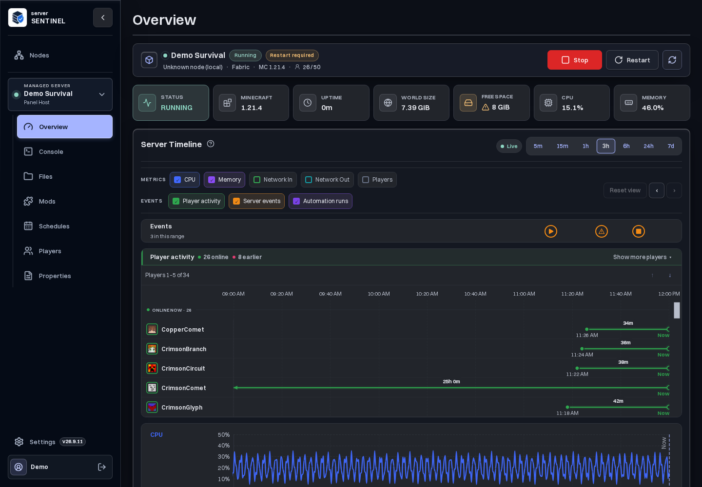

# serverSENTINEL

A web panel for managing Minecraft servers across Docker hosts: server lifecycle, live console, files, Fabric mods and Paper plugins, schedules, users, and resource monitoring.



[Console](docs/screenshots/console.png) · [Files](docs/screenshots/files.png) · [Mods](docs/screenshots/mods.png) · [Players](docs/screenshots/players.png) · [Light mode](docs/screenshots/overview-light.png)

## Install

Install Docker Engine and Docker Compose on your server host. Save this as `docker-compose.yml` in an empty directory:

```yaml
services:
  serversentinel:
    image: nl2109/serversentinel:latest
    container_name: serversentinel
    ports:
      - "${PORT:-8080}:8080"
    environment:
      SS_MODE: ${SS_MODE:-all-in-one}
      SERVERSENTINEL_DATA_DIR: /data
      SERVERSENTINEL_SERVERS_DOCKER_VOLUME: serversentinel-minecraft-servers
      SERVERSENTINEL_NODE_IMAGE: ${SERVERSENTINEL_NODE_IMAGE:-nl2109/serversentinel:latest}
      SERVERSENTINEL_TRUST_PROXY: ${SERVERSENTINEL_TRUST_PROXY:-false}
      TZ: ${TZ:-UTC}
      LOG_LEVEL: ${LOG_LEVEL:-info}
    volumes:
      - serversentinel-data:/data
      - minecraft-servers:/data/servers
      - /var/run/docker.sock:/var/run/docker.sock
    restart: unless-stopped

volumes:
  serversentinel-data:
  minecraft-servers:
    name: serversentinel-minecraft-servers
```

Start the panel and find the one-time setup token in its logs:

```bash
docker compose up -d
docker compose logs serversentinel
```

Open `http://<host-address>:8080`, enter the token, and create your administrator account. Follow the setup guide to create a Minecraft server or restore a serverSENTINEL export, then start it and check the console.

## Configuration and remote hosts

- **Port and time zone:** set `PORT` and `TZ` in a `.env` file beside your Compose file. `TZ` uses an IANA name such as `Europe/Vienna` and controls schedule timing and the default display time zone.
- **Integrations:** configure optional integrations in Settings. For environment configuration, see [`.env.example`](.env.example); add any extra variables to the Compose service's `environment` section to pass them into the container.
- **Additional hosts:** open **Nodes**, add a node, and run the generated install command on its Docker host.
- **Dedicated panel:** set `SS_MODE=panel` when Minecraft servers will run on remote nodes instead of the panel host.

The default all-in-one setup runs the panel and node agent together. Each managed Minecraft server runs in its own container.

## Access and data

The panel controls Docker containers, server files, consoles, and node credentials. Restrict access to trusted administrators and keep it on a private network or behind authenticated remote access. Docker socket access grants extensive control over the host.

The `serversentinel-data` volume stores panel data; `serversentinel-minecraft-servers` stores Minecraft server files. Back up both, plus server data on any remote nodes. Do not use `docker compose down -v` unless you intend to delete the Compose volumes and their data.

## Updates and logs

Back up your data and review the [changelog](CHANGELOG.md), then update the panel from the directory containing your Compose file:

```bash
docker compose pull
docker compose up -d
docker compose logs -f serversentinel
```

Manage remote node updates from **Nodes**. Panel logs include API requests, authentication events, and audited administration actions. Use each server's **Console** for Minecraft output.

## Docker restarts and world saves

Before planned host maintenance, stop Minecraft servers through the panel so they can save their worlds.

On Linux, Docker's `live-restore` setting can keep containers running during supported Docker daemon restarts. Add `"live-restore": true` to `/etc/docker/daemon.json`, preserving existing settings, then run `sudo systemctl reload docker`. This does not protect against a host reboot.

Managed Minecraft containers have a 60-second shutdown timeout by default. For worlds that need longer, add `SERVERSENTINEL_MINECRAFT_STOP_TIMEOUT_SECONDS` to the environment of the all-in-one service or node agent. Ensure the host's `docker.service` `TimeoutStopSec` also allows enough time for shutdown.

## Limitations

- Server creation and managed content support Fabric mods and Paper plugins.
- Existing external Minecraft servers are not the primary use case; the panel is designed for containers it manages.
- The Modrinth integration does not fully resolve dependencies or conflicts. Some mods and plugins need manual dependency installation or compatibility checks.

Licensed under the [Apache License 2.0](LICENSE).
