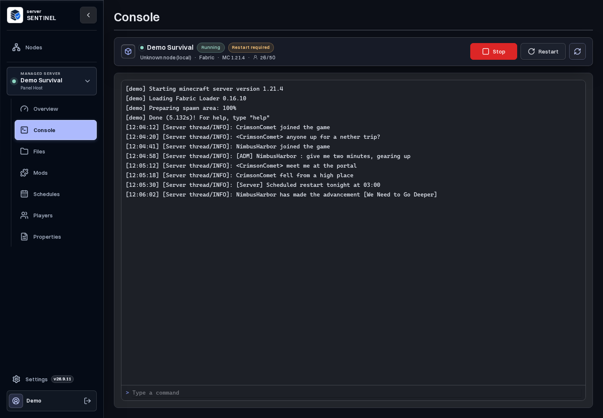
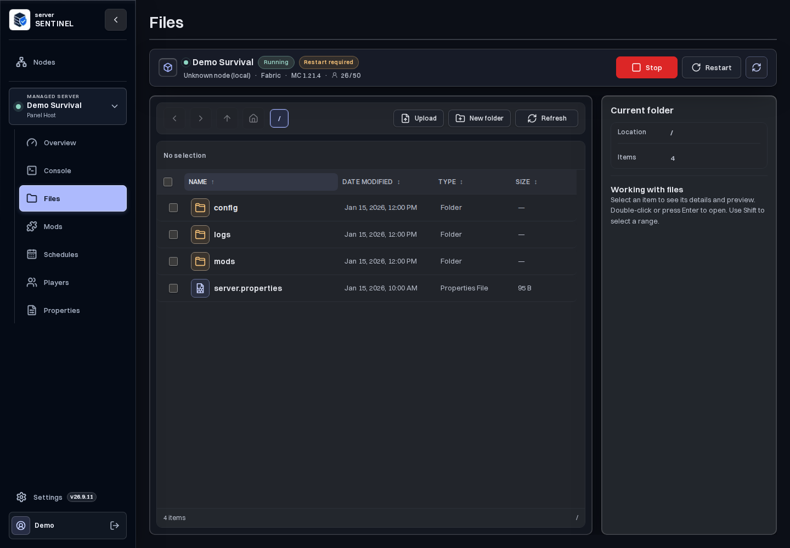
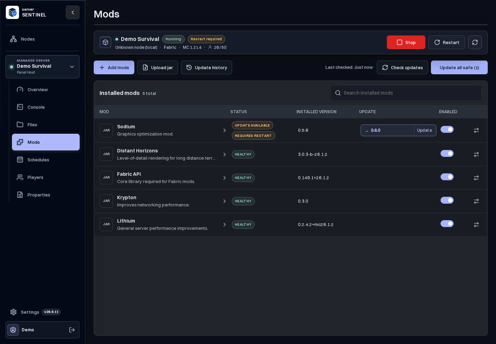
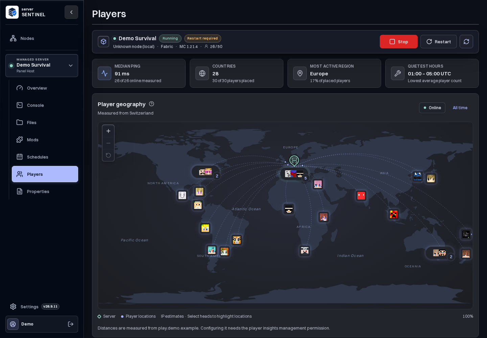
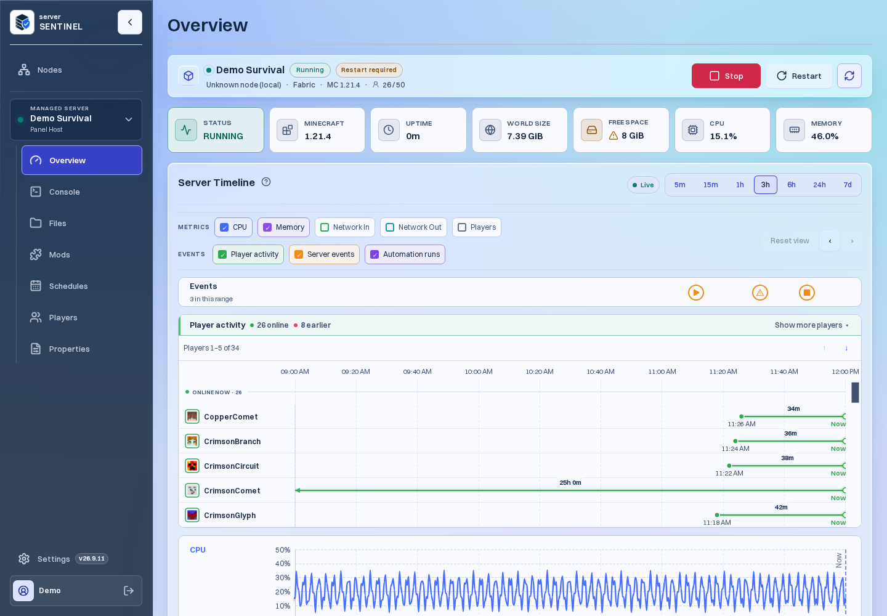

# serverSENTINEL

serverSENTINEL is a web panel for running and managing Minecraft servers and their mods with Docker. It provides a browser-based interface for handling the parts of server administration that would normally require SSH, Docker commands, editing configuration files manually, or separate tools like FileZilla and other file transfer clients.

## Features

* Create and configure Minecraft servers
* Start, stop, and restart servers
* Search for and install Fabric mods or Paper plugins through the Modrinth API
* Get notified when a *compatible* mod or plugin update is available and update in one click
* View the live console and send commands
* Browse, upload, edit, and manage server files
* Add existing mod or plugin files and manage installed content
* Schedule commands and server actions
* Manage multiple nodes from one panel
* Manage users, roles, and permissions
* Monitor server status and resource usage

serverSENTINEL is developed with AI as a tool under human guidance. I set the project's direction, make design decisions, and review and refine the work. AI helps with implementation, debugging, and iteration, while testing and cleanup are part of the development process. The focus is on building reliable systems that are easy to understand and maintain.

## Security

serverSENTINEL should be treated as an administrative tool. Access to the panel may provide control over Docker containers, server consoles, files, node secrets, and the machines hosting them.

I recommend to keep the panel isolated and not make it directly exposed to the public internet. If you want to use remote access, I would access it using a VPN, through Cloudflare Tunnel, or behind a reverse proxy with strong authentication.


## Screenshots

The screenshots below show the default dark theme. Light mode is also available from the appearance settings.

<table>
  <tr>
    <td valign="top" width="50%">
      <p align="center"><strong>Overview</strong></p>
      <a href="docs/screenshots/overview.png">
        
      </a>
      <p align="center">Server list, status, and high-level controls.</p>
    </td>
    <td valign="top" width="50%">
      <p align="center"><strong>Console</strong></p>
      <a href="docs/screenshots/console.png">
        
      </a>
      <p align="center">Live output and command input.</p>
    </td>
  </tr>
  <tr>
    <td valign="top" width="50%">
      <p align="center"><strong>File Manager</strong></p>
      <a href="docs/screenshots/files.png">
        
      </a>
      <p align="center">Browse and manage server files.</p>
    </td>
    <td valign="top" width="50%">
      <p align="center"><strong>Mod Management</strong></p>
      <a href="docs/screenshots/mods.png">
        
      </a>
      <p align="center">Manage server mods and updates.</p>
    </td>
  </tr>
  <tr>
    <td valign="top" width="50%">
      <p align="center"><strong>Players</strong></p>
      <a href="docs/screenshots/players.png">
        
      </a>
      <p align="center">Explore player geography, connection quality, activity patterns, and history.</p>
    </td>
    <td valign="top" width="50%">
      <p align="center"><strong>Light Mode</strong></p>
      <a href="docs/screenshots/overview-light.png">
        
      </a>
      <p align="center">The full interface is also available in light mode.</p>
    </td>
  </tr>
</table>


## How It Works

serverSENTINEL has two main parts: a panel that provides the web interface and API, and a node agent that manages Minecraft containers on a Docker host. Each Minecraft server runs in its own container.

- **One machine:** use the included all-in-one Docker Compose setup to run the panel and node agent together.
- **Multiple machines:** run the panel with `SS_MODE=panel`, then add a node for each Docker host through the web interface. The panel generates an install command to run on each host.

## Quick Start

Install Docker Engine and Docker Compose on the machine that will host your servers. Then clone this repository:

```bash
git clone https://github.com/R4cc/serverSENTINEL.git
cd serverSENTINEL
```

The default configuration is ready to use. To change the port, time zone, image, or optional API settings, copy [`.env.example`](.env.example) to `.env` and edit it before starting.

Start serverSENTINEL and view its logs to find the one-time setup token:

```bash
docker compose up -d
docker compose logs serversentinel
```

Open `http://localhost:8080` on that machine, or use the host's address if you are connecting from another device. Enter the setup token to create your administrator account.

### Set up your first server

1. Follow the setup guide to choose this machine or a connected node as your server host. You can leave the guide and resume it later.
2. Create a Minecraft server or restore a serverSENTINEL export.
3. Start the server and check its status and console output.
4. Review the optional integrations and time-zone settings.

To add another Docker host later, open **Nodes**, add a node, and run the generated install command on that host.

### All-in-one Docker Compose

If you prefer to use the published image without cloning the repository, save the following as `docker-compose.yml` in an empty directory. Run `docker compose up -d` from that directory, then follow the setup-token and first-server steps above.

```yaml
services:
  serversentinel:
    image: nl2109/serversentinel:latest
    container_name: serversentinel
    ports:
      - "${PORT:-8080}:8080"
    environment:
      SS_MODE: ${SS_MODE:-all-in-one}
      SERVERSENTINEL_DATA_DIR: /data
      SERVERSENTINEL_SERVERS_DOCKER_VOLUME: serversentinel-minecraft-servers
      SERVERSENTINEL_NODE_IMAGE: ${SERVERSENTINEL_NODE_IMAGE:-nl2109/serversentinel:latest}
      SERVERSENTINEL_ENABLE_DEMO: ${SERVERSENTINEL_ENABLE_DEMO:-false}
      SERVERSENTINEL_TRUST_PROXY: ${SERVERSENTINEL_TRUST_PROXY:-false}
      SERVERSENTINEL_SETUP_TOKEN: ${SERVERSENTINEL_SETUP_TOKEN:-}
      MODRINTH_API_KEY: ${MODRINTH_API_KEY:-}
      MCJARS_BASE_URL: ${MCJARS_BASE_URL:-https://mcjars.app}
      MCJARS_API_KEY: ${MCJARS_API_KEY:-}
      DOCKER_SOCKET: ${DOCKER_SOCKET:-/var/run/docker.sock}
      PORT: 8080
      LOG_LEVEL: ${LOG_LEVEL:-info}
      TZ: ${TZ:-UTC}
    volumes:
      - serversentinel-data:/data
      - minecraft-servers:/data/servers
      - /var/run/docker.sock:/var/run/docker.sock
    restart: unless-stopped

volumes:
  serversentinel-data:
  minecraft-servers:
    name: serversentinel-minecraft-servers
```

All-in-one mode requires access to the Docker socket so serverSENTINEL can create, start, and stop Minecraft containers. Only mount the socket in a trusted environment.

## Docker Restarts and World Saves

Restarting or upgrading Docker can stop running Minecraft containers. Because this happens outside serverSENTINEL, the panel cannot send the Minecraft `stop` command beforehand. Two settings help protect running servers and give worlds time to save.

### Keep containers running with live-restore

On a Linux Docker host, add `live-restore` to `/etc/docker/daemon.json`, preserving any existing settings:

```json
{
  "live-restore": true
}
```

Reload the configuration with `sudo systemctl reload docker`. Live-restore allows containers to keep running during supported Docker daemon restarts; it does not keep them running through a host reboot. serverSENTINEL logs a warning at startup if live-restore is disabled.

### Allow enough time for shutdown

When Docker stops a container, it waits for the container's stop timeout before forcibly terminating it. serverSENTINEL gives managed Minecraft containers 60 seconds by default so Minecraft has time to shut down and save the world.

If your world needs more time, set `SERVERSENTINEL_MINECRAFT_STOP_TIMEOUT_SECONDS` in the environment of the all-in-one service or node agent managing it. With Docker Compose, add this variable to the service's `environment` section. Also check `TimeoutStopSec` for the host's `docker.service`: the service manager must allow Docker enough time to finish shutting down its containers.

## Logs

View the panel's logs with `docker compose logs serversentinel`. Add `-f` to follow new entries as they arrive.

At the default `LOG_LEVEL=info`, logs use structured JSON and record completed API requests, authentication events, and audited administration actions. Request entries include the request ID, client IP, signed-in user, route pattern, response status, and duration. Passwords, session cookies, authorization headers, raw request bodies, and URL query values are excluded.

## Development

From the repository root, install dependencies with `npm install`. Then start the backend and frontend in separate terminals:

| Terminal | Command |
| --- | --- |
| Backend | `npm run dev:server` |
| Frontend | `npm run dev:web` |

Docker is still required to create and run Minecraft servers. Before submitting code changes, run these checks from the repository root:

```bash
npm test
npm run typecheck
npm run build
```

## Known Limitations

- Server creation and Modrinth content management currently support Fabric mods and Paper plugins.
- The panel is designed around Minecraft containers it manages. Managing existing external Minecraft servers is not its primary use case.
- Modrinth integration does not fully resolve dependencies or conflicts. You may need to install required dependencies or resolve incompatible mods yourself.

See [CHANGELOG.md](CHANGELOG.md) for release history. serverSENTINEL is licensed under the [Apache License 2.0](LICENSE).
